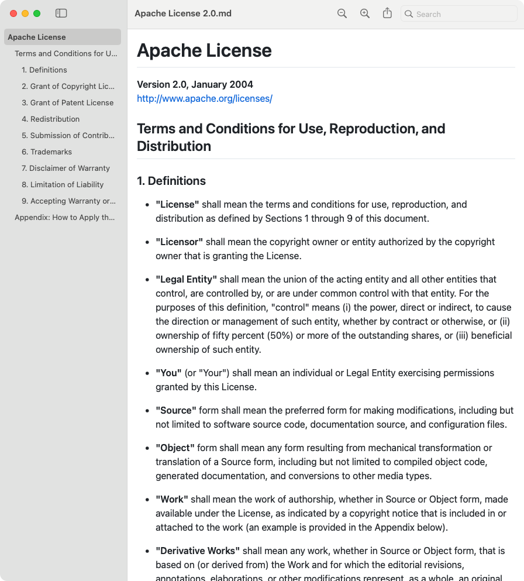

<p align="center"></p>

# MD Preview

A read-only Markdown viewer for macOS that behaves like Preview: double-click a `.md` file, get a window.



## Features

- **GitHub-style rendering** — tables, task lists, syntax-highlighted code, front matter, light and dark mode
- **Native document app** — one window per file, recent files, window restore, reopens where you left off, print and Export as PDF
- **Outline sidebar** — every heading, follows you as you scroll, click to jump
- **Find bar** — highlights every match; step through with ⌘G / ⇧⌘G
- **Live reload** — re-renders when the file is saved, keeping your place
- **Quick Look** — press Space on a `.md` file in Finder for the same rendering
- Relative images, links to other `.md` files open in MD Preview, web links in your browser
- Fully offline; scripts embedded in Markdown are never run

## Install

Requires macOS 14 or later and Xcode or the Xcode Command Line Tools (`xcode-select --install`).

```bash
git clone https://github.com/rade-popovic/MDPreview.git
cd MDPreview
./build.sh install
```

This builds the app and copies it to `/Applications`. Then open MD Preview and choose
**MD Preview → Make Default Markdown Viewer** (or use Finder's Get Info → Open with → Change All).

If another Quick Look extension for Markdown is installed, macOS may keep using it. Turn it off in
System Settings → General → Login Items & Extensions → Quick Look.

## Build only

```bash
./build.sh            # builds build/MD Preview.app without installing
```

## Project layout

- `Sources/MDPreview` — SwiftUI app (`DocumentGroup(viewing:)`) hosting a `WKWebView`
- `QuickLook` — Quick Look preview extension; renders with `Resources/web/core.js` in JavaScriptCore
- `Resources/web` — page template, renderer and styles; `vendor/` holds marked, DOMPurify,
  highlight.js and github-markdown-css
- `scripts/make-icon.swift` — regenerates `Resources/AppIcon.icns`

## License

[Apache License 2.0](LICENSE). Bundled third-party components keep their own licenses — see
[THIRD_PARTY_NOTICES.md](THIRD_PARTY_NOTICES.md).
